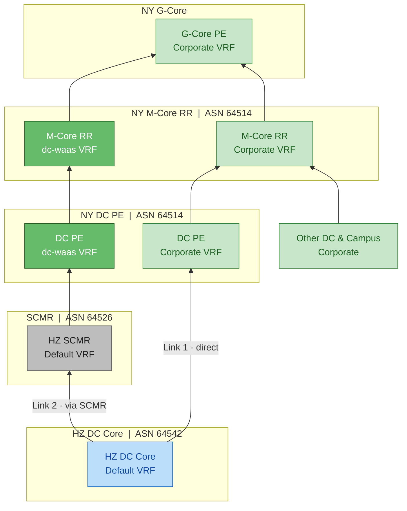

# DC Core Uplink Topology (Network Change)

## Logical Topology

## Path Description

| # | Path | VRF Flow |
|---|------|----------|
| 1 | HZ DC Core → DC PE | Default VRF → **Corporate** VRF (direct link) |
| 2 | HZ DC Core → SCMR → DC PE | Default VRF → SCMR Default VRF → **dc-waas** VRF |
| 3 | DC PE → M-Core RR | Corporate → Corporate; dc-waas → dc-waas (two separate sessions) |
| 4 | Other DC & Campus → M-Core RR | → **Corporate** VRF |
| 5 | M-Core RR → G-Core PE | Corporate + dc-waas both merge into a **single Corporate** VRF |

## AS Numbers

| Domain | ASN |
|--------|-----|
| NY M-Core / DC PE / M-Core RR | 64514 |
| SCMR | 64526 |
| HZ DC Core | 64542 |

> Key point: the two uplinks stay VRF-isolated (Corporate / dc-waas) through DC PE
> and M-Core RR, and only converge into the same Corporate VRF at G-Core PE.
